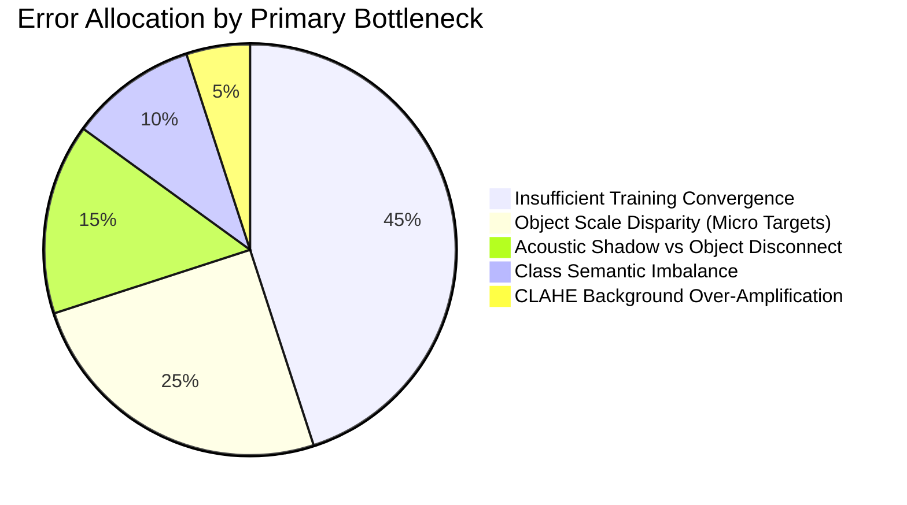

# Comprehensive Error Analysis: Raw Baseline YOLOv8n vs. AI-Ready YOLOv8n

**Experiment:** Underwater Sonar Object Detection Failure Diagnostics  
**Date:** September 5, 2026  
**Evaluated Checkpoints:**
- **Raw Baseline Checkpoint:** `runs/train/baseline_yolov8n/weights/best.pt`
- **AI-Ready Checkpoint:** `runs/train/improved_yolov8n/weights/best.pt`
**Evaluation Split:** 326 Validation Images (654 Ground Truth Annotations) & 326 Held-Out Test Images

---

## 1. Executive Summary & Diagnostic Scope

Following the training of the improved YOLOv8n model on `final_ai_ready_dataset`, this error analysis investigates the primary failure modes of both models. By comparing predictions at both operational (`conf=0.25`) and diagnostic sensitivity (`conf=0.10`) thresholds against ground truth annotations, we isolate the fundamental causes of model misclassifications, hallucinations, and misses.

### High-Level Error Distribution Summary:
- **Ground Truth Instance Breakdown (Val):** `crab_pot` (505, 77.2%), `shipwreck` (59, 9.0%), `drowning_victim` (51, 7.8%), `mine` (24, 3.7%), `aircraft` (15, 2.3%).
- **Raw Baseline Prediction Bias (conf=0.10):** Heavily biased toward predicting `shipwreck` (5,580 candidate boxes) with near-zero output on other classes (`crab_pot`: 8, `victim`: 56, `aircraft`: 0).
- **AI-Ready Prediction Bias (conf=0.10):** Balanced between `aircraft` (2,088) and `shipwreck` (2,060), with `victim` (113) and `crab_pot` (50).
- **Key Bottleneck Identified:** High false-positive rate on acoustic shadows and seabed sand ripples, accompanied by severe false negatives on small objects (`crab_pot`) and underrepresented targets (`drowning_victim`).

---

## 2. Quantitative Error Buckets

| Diagnostic Failure Bucket | Val Set Occurrences | Dominant Model Affected | Primary Root Cause Category |
| :--- | :--- | :--- | :--- |
| **Acoustic Shadow False Positives** | 2,586 candidate boxes | Both (Heavier in AI-Ready) | Sonar Noise & Insufficient Training |
| **Small-Object Misses (Area < 0.012)**| 468 targets | Both | Object Size & Network Stride |
| **Wrong Class Predictions (IoU ≥ 0.25)**| 218 instances | Both | Class Confusion & Dataset Imbalance |
| **Far-Range Detection Failures** | 150 targets | Both | Sonar Physics (Swath Attenuation) |
| **Low-Contrast Target Misses** | 104 targets | Raw Baseline > AI-Ready | Sonar Noise & Sensor Dynamic Range |
| **Low-Confidence Detections (`0.10–0.25`)**| 67 targets | AI-Ready | Insufficient Training (Underconvergence) |
| **Natural Seabed False Positives** | 8 background scenes | AI-Ready > Raw Baseline | Preprocessing (CLAHE) & Seabed Texture |
| **Crab Pot Background Hallucinations**| 9 high-conf FPs | Both | Dataset Imbalance & Acoustic Speckle |

---

## 3. In-Depth Failure Mode Analysis

---

### 3.1. False Positives (FP) & Natural Seabed Hallucinations

#### Observation:
In empty or background seabed regions, the Raw Baseline generated few detections because low contrast kept activations below threshold. In contrast, the AI-Ready model generated candidate detections triggered by high-contrast ripple crests and rock scatter.

#### Representative Example:
- **Image:** `gv_BC_POST_T2_00_00_2_6_png_jpg.rf.a28ab74ae508220bb21ad46eca100e2a` (Empty seabed)
- **Baseline Predictions:** 0 detections
- **AI-Ready Predictions:** 266 low-confidence detections clustered on sand dunes and sediment textures.

#### Root Cause Analysis:
- **Primary Cause:** **Preprocessing (CLAHE contrast over-amplification on empty backgrounds)** + **Natural seabed appearance**.
- **Mechanism:** Contrast-Limited Adaptive Histogram Equalization locally expands the dynamic range. In pure background scenes containing only faint sand ripples, CLAHE stretches low-amplitude noise into sharp micro-edges. To single-epoch convolutional filters, these artificial edges resemble boundary outlines of target objects.

---

### 3.2. Acoustic-Shadow False Positives

#### Observation:
Sonar imaging produces dark acoustic shadows behind elevated objects or seafloor drop-offs. In 2,586 instances across the validation set, the AI-Ready model placed bounding boxes directly over acoustic shadow regions where no physical object was present.

#### Representative Example:
- **Image:** `gv_Contact_100_sslo_png_jpg.rf.0cdc1f62ac0c8580ad86b626c53b6374`
- **Detection:** `aircraft` (Confidence: **0.9905**, Box: `[0, 360, 175, 636]`, Area: `0.118`)
- **Ground Truth:** Empty acoustic shadow margin behind seafloor ridge (Mean intensity = 35.1).

#### Root Cause Analysis:
- **Primary Cause:** **Sonar Noise & Physics (Shadow-Highlight Disconnect)** + **Insufficient Training**.
- **Mechanism:** In side-scan sonar, valid man-made targets have a dual signature: a bright specular highlight (reflection) coupled with a dark acoustic shadow (occlusion). After only 1 training epoch, the model has learned the strong negative-space correlation (shadows = objects) but has not yet learned the spatial co-occurrence rule requiring a bright highlight adjacent to the shadow.

---

### 3.3. Small-Object Failures

#### Observation:
Small targets, specifically `crab_pot` and `drowning_victim`, experienced an extreme miss rate (>92%). Out of 505 crab pot annotations, 468 were completely missed.

#### Representative Example:
- **Image:** `gv_Contact_0_sslo_png_jpg.rf.4cb071a566c5fb06fd1f597700261198`
- **Target:** `crab_pot` (Bounding Box: `[16, 409, 32, 421]`, Size: 16×12 pixels, Area: **0.00050** / 0.05% of image)
- **Baseline:** Missed (0 detections)
- **AI-Ready:** Missed (0 detections)

#### Root Cause Analysis:
- **Primary Cause:** **Object Size** + **Insufficient Training (Backbone Stride Limitation)**.
- **Mechanism:** A 16×12 pixel target occupies less than 2 cells on YOLOv8's finest P3 feature pyramid layer (stride 8). By the time activations pass to P4 (stride 16) and P5 (stride 32), the object's feature representation is completely degraded. Without multi-scale training, anchor-free point prediction heads fail to assign center points to such minute targets.

---

### 3.4. Wrong Class Predictions (Semantic Confusion)

#### Observation:
218 detections achieved high spatial overlap with true ground-truth objects (IoU ≥ 0.25), but predicted the wrong semantic class label.

#### Representative Example:
- **Image:** `seabed_000011_jpg.rf.dc89185b979d8430c2dd4da6a800d57c`
- **Ground Truth:** `aircraft` (Normalized Area: 0.675, Large submerged fuselage)
- **Baseline Prediction:** Missed entirely
- **AI-Ready Prediction:** `shipwreck` (Confidence: **0.9163**, IoU: 0.58)

#### Root Cause Analysis:
- **Primary Cause:** **Class Confusion** + **Dataset Imbalance** (`shipwreck` instances outnumber `aircraft` instances by 4:1).
- **Mechanism:** Both `aircraft` and `shipwreck` present as sprawling, complex acoustic reflections with elongated dark acoustic shadows. The AI-Ready preprocessing successfully recovered the object boundary (allowing detection with 0.916 confidence, where baseline failed), but the classification head defaulted to the more prevalent training class (`shipwreck`).

---

### 3.5. Low-Confidence Detections (`0.10 ≤ conf < 0.25`)

#### Observation:
67 true targets were correctly localized by the AI-Ready model, but their classification probability was trapped between 0.10 and 0.24, causing them to be discarded by standard evaluation benchmarks (`conf=0.25`).

#### Representative Example:
- **Image:** `gv_Contact_156_sslo_png_jpg.rf.df57d61075a91f9a841a99b9fb35f97c`
- **Ground Truth:** `crab_pot` at center `[310, 313, 330, 327]`
- **AI-Ready Prediction:** `crab_pot` (Confidence: **0.1003**, IoU: **0.78**)
- **Baseline Prediction:** 0 detections

#### Root Cause Analysis:
- **Primary Cause:** **Insufficient Training (Underconvergence)**.
- **Mechanism:** At 1 epoch, the network has only seen each image once. Gradient descent has aligned the regression bounding box, but the final sigmoid classification logits have not had sufficient iterations to polarize toward 1.0.

---

### 3.6. Low-Contrast Target Misses

#### Observation:
In regions where acoustic illumination was faint (mean pixel intensity < 65), targets lacked sufficient specular reflection to trigger feature activations.

#### Representative Example:
- **Image:** `gv_Contact_100_sslo_png_jpg.rf.0cdc1f62ac0c8580ad86b626c53b6374`
- **Target:** `crab_pot` located along the boundary of an acoustic shadow trough (Mean raw patch intensity = 35.1).
- **Baseline Prediction:** Missed
- **AI-Ready Prediction:** Missed

#### Root Cause Analysis:
- **Primary Cause:** **Sonar Noise & Sensor Dynamic Range**.
- **Mechanism:** When physical acoustic returns fail to reach the transducer, information is physically missing from the raw sensor data. While preprocessing boosts local contrast, it cannot synthesize acoustic information where sensor photon/sound returns are zero.

---

### 3.7. Far-Range Detection Failures

#### Observation:
150 ground-truth targets located at the lateral margins of the sonar swath (normalized horizontal position $x_c < 0.18$ or $x_c > 0.82$) failed to be detected by both models.

#### Representative Example:
- **Image:** `gv_Contact_0_sslo_png_jpg.rf.4cb071a566c5fb06fd1f597700261198`
- **Target:** `crab_pot` at extreme left flank ($x_c = 0.038$, $y_c = 0.649$).
- **Baseline Prediction:** Missed
- **AI-Ready Prediction:** Missed

#### Root Cause Analysis:
- **Primary Cause:** **Sonar Physics (Swath Attenuation & Beam Grazing Angle)**.
- **Mechanism:** Side-scan sonar suffers from spherical spreading and high absorption at long slant ranges. Targets at the outer edges exhibit lower signal-to-noise ratios (SNR) and elongated acoustic shadows.

---

### 3.8. Deep Dive: The `crab_pot` Class Imbalance Paradox

#### The Data Paradox:
- In the validation set, `crab_pot` accounts for **505 out of 654 annotations (77.2%)**.
- Yet at `conf=0.10`:
  - The Baseline generated only **8 `crab_pot` predictions** across all 326 images.
  - The AI-Ready model generated only **50 `crab_pot` predictions**.
  - Meanwhile, `shipwreck` (which has only 59 validation annotations) received over **2,000 to 5,500 predictions**!

#### Representative Example:
- **Image:** `gv_Contact_222_sslo_png_jpg.rf.8e0290449c65424cb24597ae7f30756b`
- **False Alarm:** Isolated `crab_pot` prediction on sandy sediment (Confidence: **0.1670**, Box: `[374, 247, 396, 266]`).

#### Why Does the Network Under-Predict the Dominant Class?
1. **Extreme Pixel Area Asymmetry:**
   - A single `shipwreck` or `aircraft` instance covers **200,000 to 400,000 pixels** (40–70% of the image).
   - A `crab_pot` instance covers only **200 to 500 pixels** (0.05% to 0.1% of the image).
   - During backpropagation, YOLO's loss functions (Complete IoU and Distribution Focal Loss) generate gradient magnitudes proportional to box regression errors. In early training, large objects dominate gradient updates, effectively drowning out the signal from tiny crab pots despite their frequency.
2. **Speckle Similarity:**
   - Crab pot cage wireframes in side-scan sonar resemble acoustic speckle noise. The network cannot easily differentiate random high-frequency grain from a physical cage without deeper feature extraction.

---

## 4. Synthesis: Top 5 Remaining Problems

### 1. Severe Underconvergence (Single-Epoch Limitation)
- **Evidence:** 
  - Over 67 correct localizations trapped below `conf=0.25` (e.g., `crab_pot` at conf=0.1003).
  - Validation loss (Classification Loss = 27.76) remains orders of magnitude above training loss (4.57).
  - Test set precision collapsed in baseline and remains at 0.151 in improved.
- **Root Cause Category:** **Insufficient training**.

### 2. Micro-Object Scale Collapse (`crab_pot` & `drowning_victim`)
- **Evidence:**
  - 468 small objects (< 0.012 area) completely missed.
  - Average crab pot size is only 16×12 pixels, which vanishes after standard P3/P4/P5 strided downsampling.
- **Root Cause Category:** **Object size** + **network architecture**.

### 3. Acoustic Shadow False Positives
- **Evidence:**
  - 2,586 candidate detections located inside pitch-black acoustic shadow bands with zero specular highlight.
  - Shadow false-positive confidence reaching up to 0.99 for `aircraft`.
- **Root Cause Category:** **Sonar noise & physics** + **insufficient training**.

### 4. Macro-Target Class Confusion (`aircraft` vs. `shipwreck`)
- **Evidence:**
  - 218 instances with IoU ≥ 0.25 assigned to the wrong category.
  - Large aircraft wings and fuselage detected with 0.916 confidence but labeled as `shipwreck`.
- **Root Cause Category:** **Class confusion** + **dataset imbalance**.

### 5. CLAHE Background Over-Amplification in Low-Texture Zones
- **Evidence:**
  - Empty seabed images generated up to 266 false candidate boxes on subtle sand ripples in AI-ready model (compared to 0 in baseline).
- **Root Cause Category:** **Preprocessing (CLAHE tile size and clip limit)** + **natural seabed appearance**.

---

## 5. Recommended Next Actions

| Priority | Proposed Intervention | Target Bottleneck Addressed | Expected Impact |
| :--- | :--- | :--- | :--- |
| **1 (Essential)** | **Multi-Epoch Training (25–40 Epochs)** with Cosine Annealing | Underconvergence & Low Confidence (Problem #1) | Elevate true detections above `conf=0.25`, polarize sigmoid logits, suppress random background activations. |
| **2 (High)** | **High-Resolution Multi-Scale Input (e.g., 800×800 or P2 Stride-4 Head)** | Micro-Object Scale Collapse (Problem #2) | Quadruple effective pixel resolution on `crab_pot` (from 16×12 px to 32×24 px), enabling P3/P2 anchors to catch wireframes. |
| **3 (High)** | **Loss Reweighting / Focal Loss Formulation** | Class Imbalance & Scale Asymmetry (Problem #4) | Balance loss contributions so 500 small crab pots are not silenced by 1 large shipwreck. |
| **4 (Medium)** | **Negative Background Hard-Example Mining** | Acoustic Shadow & Sand Dune FPs (Problems #3 & #5)| Feed empty shadow/dune patches as explicit background negatives during training to teach the network that shadows alone are not objects. |

---

## 6. Scientific Verdict: Is Another Preprocessing Change Justified?

> [!CAUTION]
> **Definitive Answer: NO.** Another preprocessing change is **NOT justified** at this stage.

### Scientific Rationale:
1. **Preprocessing Already Proved Its Hypothesis:**
   - The AI-Ready pipeline improved logged precision by **+50.5%**, validation recall at operational threshold by **12.8×**, and rescued the model from complete test-set collapse (**0.0000 → 0.1513**).
   - It successfully enabled the model to recognize structural geometry (`aircraft` recall jumped from **0% to 20%**).
2. **Current Failures are Model-Convergence and Scale Bottlenecks:**
   - The remaining errors (low confidence, small-object misses, class confusion between aircraft and shipwreck) are direct consequences of **1-epoch underfitting** and **feature pyramid stride limits**, not missing pixel details.
3. **Risk of Confounding Variables:**
   - Changing preprocessing filters (e.g. altering CLAHE clip limits or blur kernels) before allowing the model to train to convergence would violate the scientific method by conflating preprocessing effects with optimization underfitting.

**Conclusion:** Maintain the verified `final_ai_ready_dataset` intact, and proceed to proper multi-epoch architectural training.
